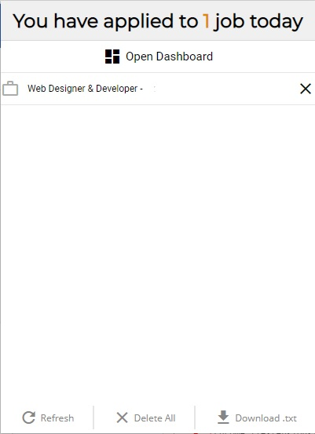
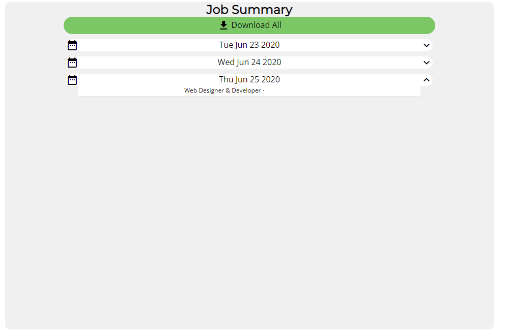

#Automated job tracker

While I am on my journey to obtain my first job working as a developer, I like to keep track of all jobs I apply to, and to have an easy way to locate what day I applied on, from which website, etc.

As of right now this extension only listens for apply events on one popular job-searching website, however I am soon to incorporate more.

Once the apply event is triggered, the job title and company name, as-well as URL to the job posting and date are posted into chrome storage. From there, the jobs applied to on the current day can be visible in the popup, but for a breakdown of each day, that is visible in the dashboard.

